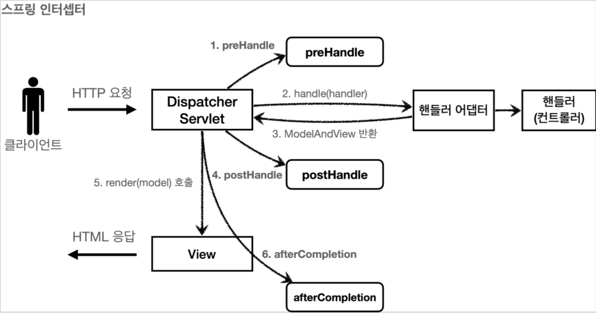
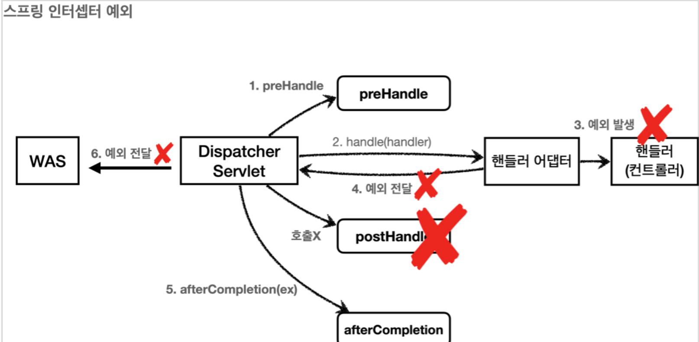

## Filter와 Interceptor와 AOP
개발을 하다보면 공통적으로 무엇인가를 처리할 경우가 굉장히 많다.<br/>
이렇게 애플리케이션에 여러 로직에서 공통으로 관심이 있는 것을 공통 관심사라고 한다.<br/>
이러한 공통 관심사는 스프링의 AOP나 스프링 Interceptor, 서블릿 필터를 사용하여 해결하는 경우가 많다. <br/>
이 세가지의 차이점은 무엇일까? 그걸 한번 알아보려 한다.

## Filter
필터는 말그대로 요청과 응답을 필터처리 하는 역할이다.

### 필터 흐름
```mermaid 
flowchart LR  
A[HTTP 요청] --> B[WAS] --> C[필터] --> D[서블릿] --> E[컨트롤러]
```
+ 필터를 적용하면 필터가 호출된 이후에 서블릿이 호출 된다.
  + 서블릿은 디스패처 서블릿을 말한다.

### 필터 제한
```mermaid 
flowchart LR 
A[HTTP 요청] --> B[WAS] --> C[필터] -- 적절하지 않은 요청이라고 판단 --> D[서블릿 호출X]
```

### 실행 메서드
+ init() :필터 초기화 메서드, 서블릿 컨테이너가 생성될 때 호출된다.
+ **doFilter()**:고객의 요청이 올 때 마다 해당 메서드가 호출된다. 필터의 로직을 구현하면 된다.
+ destroy(): 필터 종료 메서드, 서블릿 컨테이너가 종료될 때 호출된다.

## Interceptor

스프링 인터셉터도 서블릿 필터와 같이 웹과 관련된 공통 관심 사항을 효과적으로 해결할 수 있는 기술이다.<br/>
서블릿 필터가 서블릿이 제공하는 기술이라면, 스프링 인터셉터는 스프링 MVC가 제공하는 기술이다.<br/>
둘다 웹과 관련된 공통 관심 사항을 처리하지만, 적용되는 순서와 범위, 그리고 사용방법이 다르다.
+ 스프링 인터셉터는 디스패처 서블릿과 컨트롤러 사이에서 컨트롤러 호출 직전에 호출 된다.
+ 스프링 인터셉터는 스프링 MVC가 제공하는 기능이기 때문에 결국 디스패처 서블릿 이후에 등장하게 된다.<br/>
  스프링 MVC의 시작점이 디스패처 서블릿이라고 생각해보면 이해가 될 것이다.
+ 스프링 인터셉터에도 URL 패턴을 적용할 수 있는데, 서블릿 URL 패턴과는 다르고, 매우 정밀하게 설정할 수 있다.

### 인터셉트 흐름
```mermaid 
flowchart LR  
A[HTTP 요청] --> B[WAS] --> C[필터] --> D[서블릿] --> E[스프링 인터셉트] --> E[컨트롤러]
```


+ **preHandle**: 컨트롤러 호출 전에 호출된다. (더 정확히는 핸드러 어댑터 전에 호출)
  + **preHandle**의 응답값이 true면 다음으로 진행, false면 더 이상 진행하지 않는다.
+ **postHandle**: 컨트롤러 호출 후에 호출된다. (정확히는 핸들러 어댑터 호출 후에 호출)
+ **afterCompletion** : 뷰가 렌더링 된 이후에 호출된다.


### 인터셉트 제한
```mermaid 
flowchart LR 
A[HTTP 요청] --> B[WAS] --> C[필터] --> D[서블릿] --> E[스프링 인터셉트] -- 적절하지 않은 요청이라고 판단 --> F[컨트롤러 요청X]
```

+ **preHandle**: 컨트롤러 호출 전에 호출된다.
+ **postHandle**: 컨트롤러에서 예외가 발생하면 **postHandle**은 호출되지 않는다.
+ **afterCompletion**: **afterCompletion**은 항상 호출된다. 이 경우 예외를 파라미터로 받아서 어떤 예외가 발생했는지 로그로 출력할 수 있다.

## AOP
OOP로 처리기에는 다소 까다로운 부분을 AOP로 중복을 줄이기 위해 종당면(관점)에서 바라보고 처리한다.
+ 로깅, 트랜잭션, 인증

### Interceptor, Filter와 다른점
+ Interceptor와 Filter와 달리 메서드 전후의 지점에 설정이 가능하다.<br/>
+ Interceptor와 Filter는 주소로 대상을 구분해서 걸러야 하는데 AOP는 주소 파라미터 애노테이션 등 다양한 방법으로 대상을 지정한다.

###AOP흐름
```mermaid 
flowchart LR  
A[HTTP 요청] --> B[WAS] --> C[필터] --> D[서블릿] --> E[스프링 인터셉트] -->E[AOP] --> F[컨트롤러]
```
+ AOP는 메소드 앞에 Proxy패턴의 형태로 실행된다.


### AOP 기본 개념
+ **Ascpect**: 여러 클래스나 기능에 걸쳐서 있는 관심사, 그리고 그것들을 모듈화 함
+ **Advice**: 조언, AOP에서 실제로 적용하는 기능(로깅, 트랜잭션, 인증 등)을 뜻함
+ **Join point**: 모듈화된 특정 기능이 실행될 수 있는 연결 포인트
+ **Pointcut**: Join point 중에서 해당 Aspect를 적용할 대상을 뽑을 조건식
+ **Target Object**: Advice가 적용될 대상 오브젝트
+ **AOP Proxy**: 대상 오브젝트에 Aspect를 적용하는 경우 Advice를 덧붙이기 위해 하는 작업을 AOP Proxy라고 한다.
  + 주로 CGLIB(Code Generation Library, 실행 중에 실시간으로 코드를 생성하는 라이브러리) 프록시를 사용하여 프록싱 처리를 한다.
+ **Weaving**: Advice를 비즈니스 로직 코드에 삽입하는 것을 말함

AOP에 대해서는 따로 정리하는 시간을 가져야 할 것 같다.

